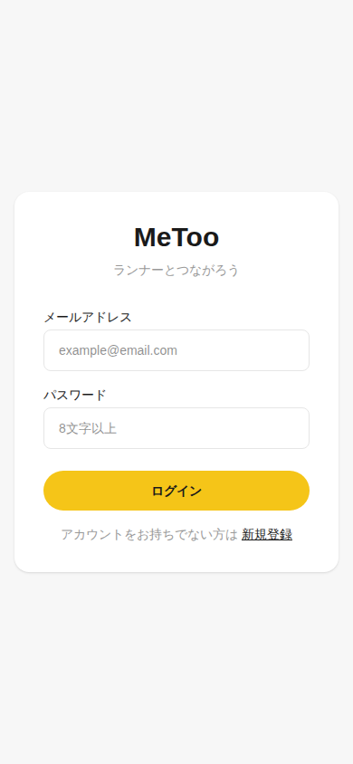
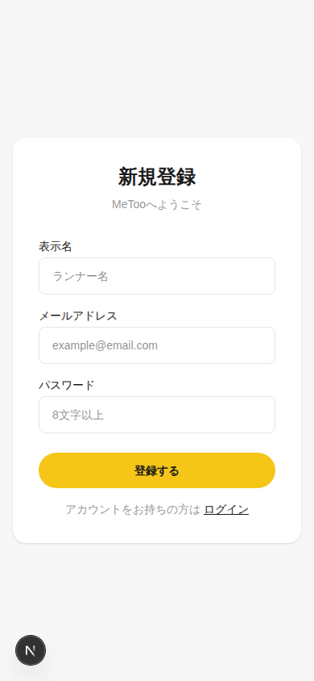

# MeToo

ランナーの「私も」を叶える、スポーツコミュニティマッチングアプリ。

走りたい場所・日時・ペースで仲間を募集し、参加申請 → 承認 → グループトークで合流するまでをひとつのアプリで完結させる。

## 中核フロー

```
募集を探す（さがす） → 参加申請 → 主催者が承認 → グループトーク（はなす） → 一緒に走る
```

## 画面（実装済み）

現在 S02 ログイン・S03 新規登録を実装済み。全13画面の仕様は <docs/01_screen_design.md> を参照。

|S02 ログイン|S03 新規登録|
|:---:|:---:|
|||

## 技術スタック

|カテゴリ   |採用                                      |
|-------|----------------------------------------|
|フレームワーク|Next.js (App Router) / TypeScript strict|
|スタイリング |Tailwind CSS                            |
|認証     |NextAuth.js v5                          |
|DB     |Neon (PostgreSQL) + Prisma              |
|画像ストレージ|Cloudflare R2                           |
|リアルタイム |Pusher                                  |
|ホスティング |Vercel                                  |

## 技術選定の理由

### Next.js (App Router)

フロントエンドと API を同一リポジトリで管理でき、Server Components で DB 直接アクセスが可能。Vercel との相性が最も高く、開発効率が優れている。

### TypeScript (strict mode)

型安全により実行時エラーを防ぎ、下位 AI モデル運用時のガードレール機能を果たす。

### Tailwind CSS

短時間で UI を構築でき、開発速度に優れている。設計トークンの一元管理が容易。

### NextAuth.js v5

メール + パスワード認証で完全無料。Next.js App Router ネイティブ対応で、複雑な自前実装を回避できる。

### Neon (PostgreSQL)

無料枠（月 100 CU 時間・0.5GB・転送 5GB）が実用的で、超過時は停止するだけで勝手に課金されない。スケールゼロにより、アクセスがない時間はコスト消費がゼロ。PlanetScale（無料枠廃止）や Supabase（7 日間不使用停止・無料枠 500MB）を比較検討した結果。

### Prisma (ORM)

schema.prisma を DB 定義の唯一の正とでき、マイグレーションと TypeScript 型の自動生成により運用効率が向上。Neon との組み合わせ実績が豊富。

### Cloudflare R2

データ転送（egress）が完全無料で、ストレージも月 10GB 無料。S3 比で圧倒的にコスパが良い。アバター画像用途で、クライアント側圧縮により MVP 期に超過の心配がない。

### Pusher (Sandbox)

トークのリアルタイム配信で、「送った瞬間に届く」体験を実現。無料枠（同時接続 200・20 万メッセージ/日）で MVP 期をカバー。SSE は Vercel Hobby で 10 秒でタイムアウトする制約があり、ポーリングも手間のため、Pusher を採用。

### 地図（Google Maps リンク方式）

2025 年 3 月の Google Maps API 料金改定（月 1 万回まで）により、埋め込み地図は最大の課金リスクだった。代わりに「住所表示 + Google マップで開くリンク」により、キー不要・完全無料で対応。

### Vercel (Hobby)

Next.js との相性が最良で、デプロイが簡単。商用化時に Cloudflare Pages 移行か Vercel Pro（$20/月）を判断する。Cloudflare Workers は機能制限・情報量の少なさから初期採用を見送った。

詳細な比較検討内容は [docs/05_tech_stack.md](docs/05_tech_stack.md)（技術スタック・ディレクトリ構造）と [docs/06_operations.md](docs/06_operations.md)（無料枠・コスト最適化・運用ルール）を参照。

## ドキュメント

設計の正は `docs/` にある。**実装・修正の前に必ず読むこと。**

|ファイル                                |内容                 |
|------------------------------------|-------------------|
|<docs/01_screen_design.md>          |全13画面の仕様・遷移図       |
|<docs/02_functional_requirements.md>|機能要件・MVPスコープ       |
|<docs/03_db_design.md>              |DB設計（9テーブル）        |
|<docs/04_api_design.md>             |API設計              |
|<docs/05_tech_stack.md>             |技術選定・ディレクトリ構造      |
|<docs/06_operations.md>             |無料枠運用・コスト最適化・AI開発体制|
|docs/metoo-ui-v2.tsx                |UI設計図（全13画面モック）    |

AI（Claude Code）での開発ルールはリポジトリ直下の <CLAUDE.md> を参照。

## ローカル開発

```bash
# 依存インストール
npm install

# 環境変数を設定（.env.example をコピーして値を埋める）
cp .env.example .env.local

# DBマイグレーション
npx prisma migrate dev

# 開発サーバー起動
npm run dev
```

環境変数の一覧と取得先は <docs/06_operations.md> を参照。

## デプロイ

- `main` ブランチへのマージで Vercel が自動デプロイ
- `main` は保護ブランチ。マージ判断は人間のみが行う

## アーキテクチャ規律

Bulletproof 思想を採用。`src/features/` 配下に機能単位で完結させ、feature 間の直接 import は禁止（各 feature の `index.ts` 経由のみ）。詳細は <CLAUDE.md>。