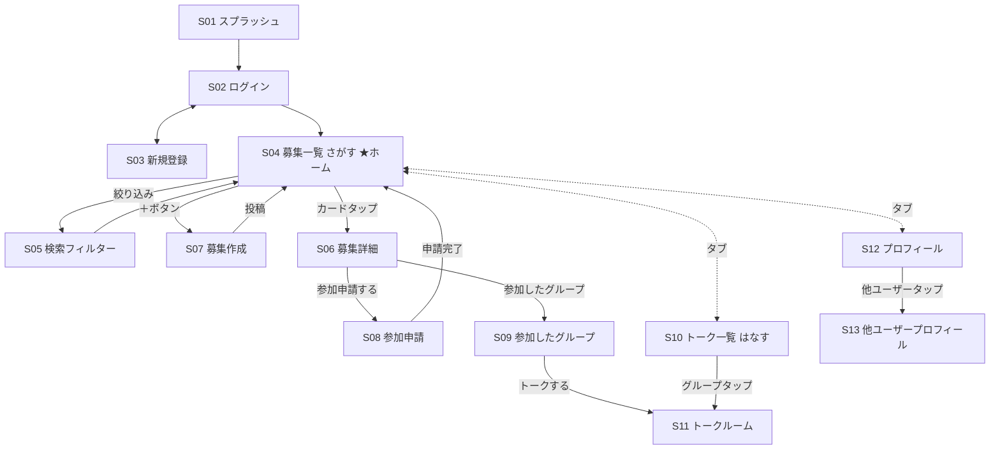

# 画面設計書 — MeToo

作成日：2026-05-13  
バージョン：1.0

-----

## 1. 画面一覧

|No |画面名        |説明                    |
|---|-----------|----------------------|
|S01|スプラッシュ     |起動時のロゴ表示              |
|S02|ログイン       |メール・パスワードでログイン        |
|S03|新規登録       |アカウント作成               |
|S04|募集一覧（さがす）  |募集投稿の一覧表示             |
|S05|検索フィルター    |エリア・距離・ペース・レベル・日付で絞り込み|
|S06|募集詳細       |募集の詳細情報・地図リンク・参加申請ボタン |
|S07|募集作成       |新規募集投稿フォーム            |
|S08|参加申請       |申請メッセージ入力・送信          |
|S09|参加したグループ   |参加メンバー一覧・トークへの導線      |
|S10|トーク一覧（はなす） |参加中のグループチャット一覧        |
|S11|トークルーム     |グループチャット画面            |
|S12|プロフィール     |自分のプロフィール表示・編集        |
|S13|他ユーザープロフィール|他ユーザーのプロフィール閲覧        |

-----

## 2. 画面遷移図

```
[S01 スプラッシュ]
        ↓
   ┌────┴────┐
[S02 ログイン] [S03 新規登録]
   └────┬────┘
        ↓
══════════════════════════════════════
  タブバー（常時表示）
  [はなす] [さがす（中央・メイン）] [プロフィール]
══════════════════════════════════════

【さがすタブ】
[S04 募集一覧]
    ├── 絞り込みボタン → [S05 検索フィルター（モーダル）] → S04に反映
    ├── +ボタン → [S07 募集作成]
    └── カードタップ → [S06 募集詳細]
                            ├── 参加申請するボタン → [S08 参加申請]
                            │                           └── 申請する → S04
                            └── 参加したグループ → [S09 参加したグループ]
                                                        └── トークするボタン → [S11 トークルーム]

【はなすタブ】
[S10 トーク一覧]
    └── グループタップ → [S11 トークルーム]

【プロフィールタブ】
[S12 プロフィール]
    ├── 編集 → プロフィール編集（インライン or 別画面）
    └── 他ユーザーのアイコンタップ → [S13 他ユーザープロフィール]
```

### 遷移図（Mermaid）



-----

## 3. 各画面の詳細

### S04 募集一覧（さがす）

**ヘッダー**

- 左：MeTooロゴ（MTアイコン）
- 中：「探す」タブ（アンダーライン）
- 右：検索アイコン、＋ボタン（募集作成）、プロフィールアイコン

**ページ上部**

- タイトル：「ランナーを探す」
- サブ：「一緒に走る仲間を見つけよう！」
- 件数表示（例：128件の募集）
- 絞り込みボタン / 並び順ボタン（新着順）

**カード（1件）**

- 左：ユーザーアバター（イニシャル）
- ユーザー名・年齢・属性（例：24歳・社会人ランナー）
- 募集タイトル（太字）
- 本文プレビュー（2行省略）
- タグ：ペース / 人数 / 距離 / 日時 / エリア
- 右上：お気に入り（☆）

-----

### S05 検索フィルター（モーダル）

- エリア（ドロップダウン）
- 距離（ドロップダウン）
- ペース（ドロップダウン）
- 参加人数（ドロップダウン）
- レベル（チェックボックス：初心者歓迎 / 中級者向け / 上級者向け）
- 日付（ドロップダウン：いつでも / 今週 / 今月）
- リセットボタン / 検索するボタン

-----

### S06 募集詳細

- 戻るボタン
- 投稿者：アバター・名前・年齢・属性
- タイトル（大きく）
- タグ一覧（ペース・人数・距離・日時・エリア）
- 本文
- 集合場所（名称＋住所＋「Googleマップで開く」リンク。地図の埋め込みは行わない→docs/06参照）
- 予定コース
- 荷物・その他
- お気に入り（☆）/ メニュー（…）
- 下部固定：「参加申請する」ボタン（黄色）

-----

### S07 募集作成

- 戻るボタン
- スポーツ種別
- タイトル
- 日時
- 集合場所（名称・住所を入力。座標は任意）
- 予定コース
- 距離
- ペース
- レベル
- 募集人数
- 荷物・その他
- コメント（自由記述）
- 下部：「募集を投稿する」ボタン

-----

### S08 参加申請

- 戻るボタン・タイトル「参加申請」
- 申請先の募集情報サマリー（アバター・名前・タグ）
- メッセージ入力欄（任意・200文字以内）
- 文字カウント表示
- 下部：「申請する」ボタン（黄色）

-----

### S09 参加したグループ

- 戻るボタン・タイトル「参加したグループ」
- 募集情報サマリー（黄色背景カード）
- 参加メンバー一覧（アバター・名前・年齢・主催者バッジ）
- 下部：「トークする」ボタン

-----

### S10 トーク一覧（はなす）

- グループ一覧
- 各行：グループアバター・タイトル・最新メッセージ・日時・未読バッジ

-----

### S11 トークルーム

- ヘッダー：戻る・グループ名・メンバー情報
- メッセージ一覧（自分：右・他者：左）
- 下部入力欄：テキスト入力＋送信ボタン

-----

### S12 プロフィール

- アバター（画像 or イニシャル）
- 名前・年齢・属性
- ペース・活動エリア・目標
- 自己紹介
- 参加履歴
- 編集ボタン

-----

### S13 他ユーザープロフィール

- S12とほぼ同じ構成
- 編集ボタンなし

-----

## 4. タブバー構成

|タブ         |アイコン     |説明       |
|-----------|---------|---------|
|はなす        |チャットアイコン |トーク一覧    |
|さがす（中央・メイン）|虫眼鏡（黄色背景）|募集一覧     |
|プロフィール     |人物アイコン   |自分のプロフィール|

※ 左端にユーザーのアバター（イニシャル）も常時表示

-----

## 5. 共通UI仕様

|項目      |内容                          |
|--------|----------------------------|
|メインカラー  |黄色（#F5C518 相当）              |
|アクセントカラー|黒（#1A1A1A）                  |
|ボタン（主）  |黄色・角丸・全幅                    |
|ボタン（副）  |白・ボーダー                      |
|フォント    |Hiragino Sans / Noto Sans JP|
|アバター    |画像なしの場合はイニシャル表示（グレー背景）      |
|タグ      |角丸・グレー背景・小テキスト              |

-----

*次ドキュメント：02_functional_requirements.md*